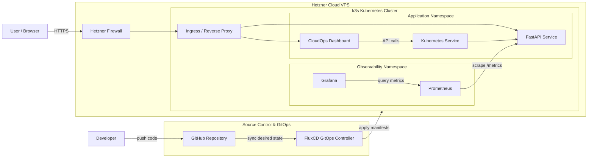
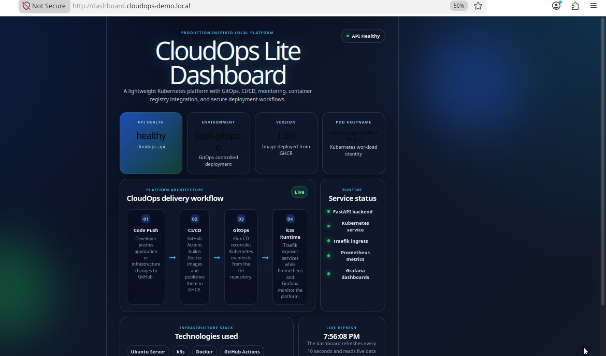
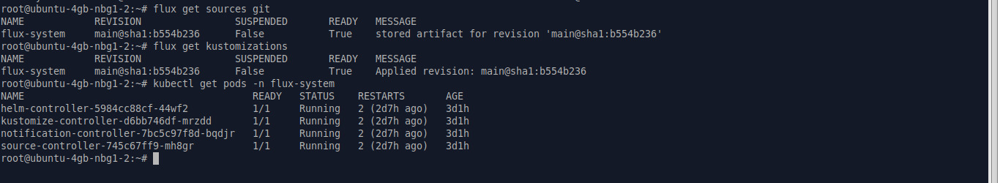
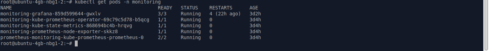
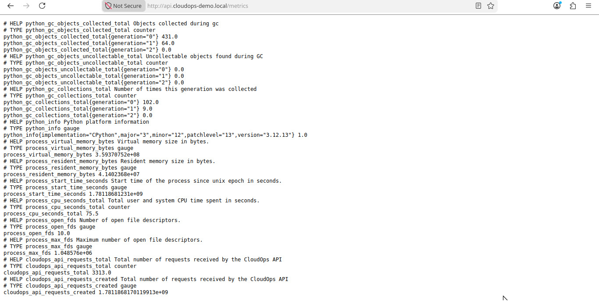
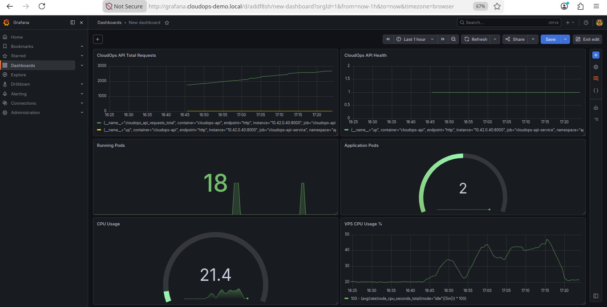
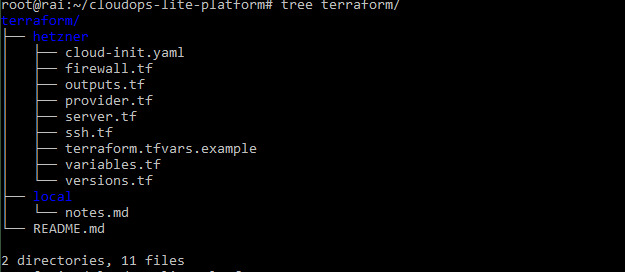

# CloudOps Lite Platform on Hetzner Cloud

Production-inspired CloudOps and Platform Engineering project deployed on a Hetzner Cloud VPS using **k3s Kubernetes**, **FluxCD GitOps**, **Terraform structure**, **FastAPI**, **Prometheus**, **Grafana**, and a custom monitoring dashboard.

The project demonstrates a full cloud deployment workflow: infrastructure preparation, Kubernetes workload deployment, GitOps synchronisation, monitoring, metrics exposure, and dashboard-based visibility.

---

## Project Overview

CloudOps Lite Platform is a lightweight DevOps platform designed to simulate real-world cloud operations on a minimal cloud server.

The platform was first prepared as a local lab, then deployed to a Hetzner Cloud VPS using k3s. It includes a containerised FastAPI service, Kubernetes manifests, GitOps workflow with FluxCD, Prometheus metrics scraping, Grafana dashboards, and a custom CloudOps dashboard.

---

## Architecture



---

## Technology Stack

| Area                     | Tools                 |
| ------------------------ | --------------------- |
| Cloud Provider           | Hetzner Cloud         |
| Kubernetes               | k3s                   |
| GitOps                   | FluxCD                |
| Infrastructure Structure | Terraform             |
| Backend Service          | FastAPI               |
| Monitoring               | Prometheus            |
| Visualisation            | Grafana               |
| Version Control          | GitHub                |
| Operating System         | Ubuntu Server / Linux |

---

## Key Features

* Hetzner-hosted Kubernetes deployment using k3s
* GitOps workflow with FluxCD
* FastAPI application deployed as a Kubernetes service
* `/health` endpoint for service health validation
* `/metrics` endpoint for Prometheus scraping
* Grafana dashboard for monitoring and observability
* Terraform-based infrastructure organisation
* Custom CloudOps dashboard for platform visibility
* Portfolio-ready documentation and screenshots

---

## Screenshots

### Kubernetes Pods

Shows the Kubernetes workloads running inside the k3s cluster.



---

### FluxCD Workflow

Shows the GitOps workflow and FluxCD synchronisation state.



---

### Monitoring Pods

Shows the monitoring stack pods deployed in the cluster.



---

### CloudOps Dashboard Overview

Custom dashboard showing platform status, cluster information, API health, Prometheus, and Grafana status.


---

### API Metrics

FastAPI metrics endpoint exposed for Prometheus scraping.



---

### Grafana Dashboard

Grafana dashboard used to visualise platform and application metrics.



---

### Terraform Project Tree

Terraform folder structure used to organise infrastructure configuration.



---

## Project Structure

```txt
cloudops-lite-platform/
├── apps/
│   └── cloudops-api/
│       ├── main.py
│       ├── Dockerfile
│       └── requirements.txt
├── clusters/
│   └── hetzner/
│       └── manifests/
├── infra/
│   └── terraform/
├── docs/
│   └── screenshots/
│       ├── kubernetes-pods.jpeg
│       ├── flux-workflow.jpeg
│       ├── monitoring-pods.jpeg
│       ├── dashboard-overview.jpeg
│       ├── api-metrics.jpeg
│       ├── grafana-dashboard.jpeg
│       └── terraform-tree.jpeg
└── README.md
```

---

## What This Project Demonstrates

This project proves practical experience with:

* Deploying Kubernetes workloads on a real cloud VPS
* Managing infrastructure and application state through GitOps
* Building and exposing a containerised API service
* Monitoring services using Prometheus and Grafana
* Organising infrastructure code with Terraform
* Creating production-inspired documentation for DevOps projects

---

## Status

The platform is deployed on Hetzner Cloud and documented with screenshots showing the running Kubernetes workloads, FluxCD workflow, monitoring stack, API metrics, Grafana dashboard, and Terraform structure.

---

## Author

**Rai Trabelsi**
Cloud, Infrastructure, DevOps, and Platform Engineering
